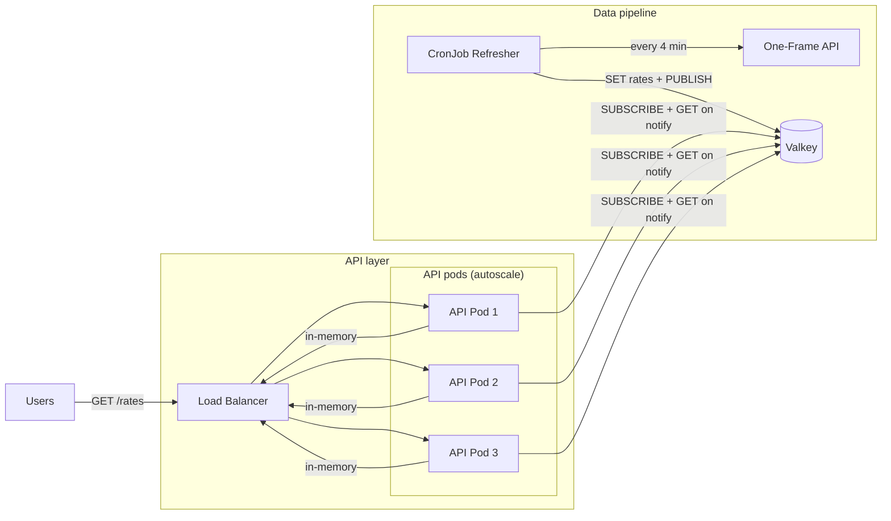

# Forex Proxy – Solution Summary

## Architecture



Two-binary design aligned with the design doc: a **Refresher** CronJob and a long-running **API** service.

- **Refresher:** Fetches all USD pairs from One-Frame every 4 minutes, writes JSON to Valkey, then **PUBLISHes** to channel `rates_updated` so API pods sync immediately.
- **Valkey:** Single key `rates` (JSON array). Refresher overwrites; no TTL. Channel `rates_updated` used for event-driven sync.
- **API (multiple pods):** **Event-driven sync:** each pod SUBSCRIBEs to `rates_updated`; on each message, pod fetches from Valkey (GET rates) and updates in-memory cache. Initial sync on startup, then sync only when Refresher publishes. All GET /rates are served from memory.

Data path: One-Frame -> Valkey -> in-memory cache -> HTTP response. No One-Frame calls on request path. Sync path: Refresher PUBLISH -> Valkey -> API pods receive message -> GET rates -> update cache.

I deployed the services on my personal kubernetes cluster. You can try by running:

```
curl -s "https://forex.leanstax.com/rates?from=USD&to=EUR" 2>&1 | head -3

# {"from":"USD","to":"EUR","price":0.71810472617368925,"timestamp":"2026-02-10T07:12:33.366Z"}
```

## Backend Implementation

**Stack:** Scala 2.13, cats-effect, http4s (Blaze), circe, redis4cats-effects + redis4cats-streams (Valkey + PubSub).

**Composition:** `Module.createApp` returns `Resource[F, HttpApp[F]]`: allocates Valkey client and a pub/sub subscriber connection, builds `RatesCache` (Ref + sync-on-notify), starts the sync fiber (initial sync + stream of sync triggers from SUBSCRIBE `rates_updated`), yields an `HttpApp` that uses the cache.

**Cache layer:** `RatesCache` is a trait (getRates, updateRates). `RatesCache.make` takes ValkeyClient and a `Stream[F, Unit]` sync trigger (e.g. pub/sub messages). It does initial sync, then runs `syncTrigger.evalMap(_ => sync())`. Returns `(RatesCache[F], F[Unit])`. `CachedRatesInterpreter` implements the rates algebra: same-currency 1.0, direct USD lookup, inverse for to-USD, cross-rates via USD (e.g. EUR/JPY = USD/JPY / USD/EUR).

**Refresher:** Standalone entrypoint `RefresherMain`. Uses OneFrameClient (all USD pairs in one batch), then ValkeyClient.setRates and ValkeyClient.publishRatesUpdated() so API pods are notified. Retries and error handling around the single refresh step.

**Currency:** Domain supports all ISO 4217 codes (170+). `fromString` accepts any code in the whitelist. One-Frame fetch uses a fixed set of 9 currencies; API accepts any valid code and returns 404 for pairs not in cache.

**HTTP:** GET /rates with query params `from`, `to`. Validation via `QueryParamDecoder`; invalid or missing params yield 404. Response JSON: from, to, price, timestamp. Timeout middleware on the app.

## Testing

- **Unit:** Scala specs (RatesCache, CachedRatesInterpreter, Refresher, Valkey client, OneFrame client). Run in Docker via `make test-unit` (Java 17 image) so no local JVM required.
- **E2E:** Python suite in `e2e/`: API health, valid rates, validation (4xx), auth placeholder, errors, performance, cache/sync, Refresher–Valkey, One-Frame connectivity. Runner discovers `test_*.py` and runs them; optional `e2e_common.run_suite` for structure.
- **Load:** Single script targets 1k RPS for 20s; pass only if 100% of requests succeed. `make load-test` brings up the stack, runs the script (20s, 100 workers), tears down. Measured ~2.5k RPS at 100% success in Docker.

## K3s deployment

Deployment to a K3s cluster (e.g. PetitoLabs) is done via plain manifests in `manifests/`:

| Resource | File | Description |
|----------|------|-------------|
| Namespace | `namespace.yaml` | `forex` |
| Valkey | `valkey-deployment.yaml`, `valkey-service.yaml` | Redis-compatible store; API and Refresher connect to `redis://valkey.forex.svc.cluster.local:6379` |
| One-Frame | `one-frame-deployment.yaml`, `one-frame-service.yaml` | Rate provider (image: `paidyinc/one-frame:latest`); Refresher calls it |
| Forex API | `forex-api-deployment.yaml`, `forex-api-service.yaml` | Deployment (2 replicas), image `registry.leanstax.com/forex:latest`, command `api` |
| Refresher | `forex-refresher-cronjob.yaml` | CronJob every 4 min, command `refresher` |
| Ingress | `forex-ingress.yaml` | Host `forex.leanstax.com` → forex-api:8080, TLS via cert-manager (Let’s Encrypt), ingressClassName: traefik |

**Connect to K3s (PetitoLabs):** From the infrastructure repo, start the SSH tunnel and use the local kubeconfig: `./scripts/setup-petitolabs.sh full` then `export KUBECONFIG=/path/to/petitolabs-infrastructure/k3s-kubeconfig-local.yaml`.

**Apply:** `kubectl apply -f manifests/` (from the forex repo). Optional: create a docker-registry secret in namespace `forex` for `registry.leanstax.com` and uncomment `imagePullSecrets` in the API deployment and CronJob.

**Live:** `https://forex.leanstax.com/rates?from=USD&to=EUR`

## Deliverables

- Single codebase with two runnable entrypoints (API and Refresher).
- Docker Compose for local/E2E: Valkey, One-Frame, Refresher (one-shot), API. E2E tests run in a container against the API; Refresher populates Valkey before API starts (depends_on ordering).
- **K3s manifests** in `manifests/`: Valkey, One-Frame, forex-api Deployment, forex-refresher CronJob, Ingress for `forex.leanstax.com`; see `manifests/README.md` for connect and apply steps.
- Makefile: build, test-unit (Docker), test-unit-local, e2e-test, load-test, all with Java 17 where relevant.
- Design doc and workspace docs describe the same architecture (CronJob, Valkey, API with event-driven pub/sub sync and in-memory serving).
